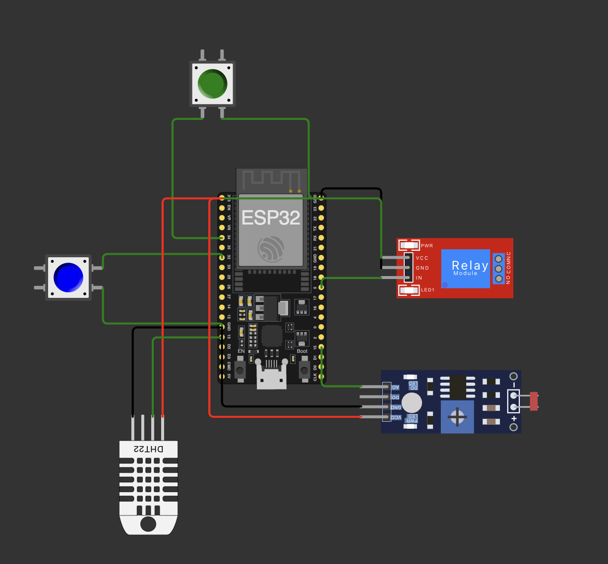

# Fase 3 - Cap 1 - Construindo uma máquina agrícola

* **Nome:** Daniel de Vasconcelos Freire
* **Matricula:** rm559935
* **YouTube:** https://youtu.be/xBqkYX_qT7M

## Objetivo


**Solução**: Desenvolver um circuito, que baseado na regra abaixo, aciona o rele que inicia irregação e exporta os dados na porta serial no formato json para importa no projeto python

**regra** : Fosfóro (P) valor true, Potássio (k) valor true, ldr superior a 500 e umidade menor ou igual 40 ou temparatura maior que 30.


## Estrutura do projeto (Arquivos principais)

* **menu.py** - Responsável pela gestão de todo menu do software, utilizando função, metodo, recursividade, dicionarios, etc
* **repository/*** - Responsável pela persistencia e consulta de dados no banco de dados oracle.
* **scripts** - Todos os scripts para banco de dados
* **esp32** - Arquivos do projeto wokwi.com




## Requisitos para rodar o projeto

* Python 3.11
* Gerenciador de pacotes **poetry**

## Rodar sistema

```bash
    poetry install
    python src/main.py
```

1. Copiar o json gerado no circuito para o arquivo na pasta **assets/registry.json**
2. Escolher opção 0 - Importa, para importa os dados para o banco de dados
3. Escolher opção 1 - Listar, para mostrar os dados